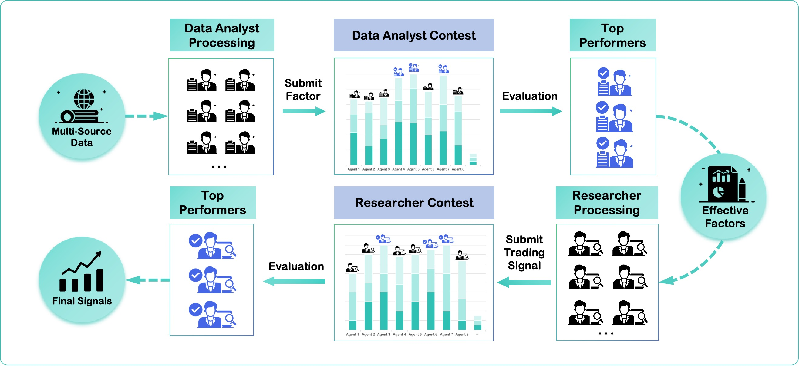
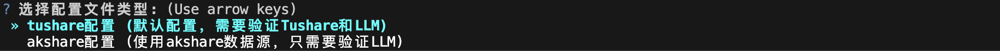
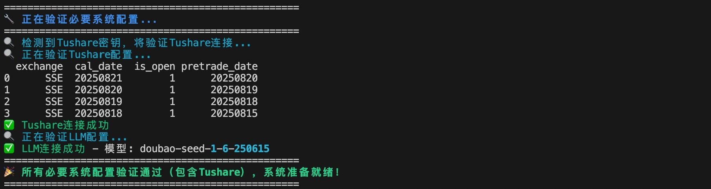
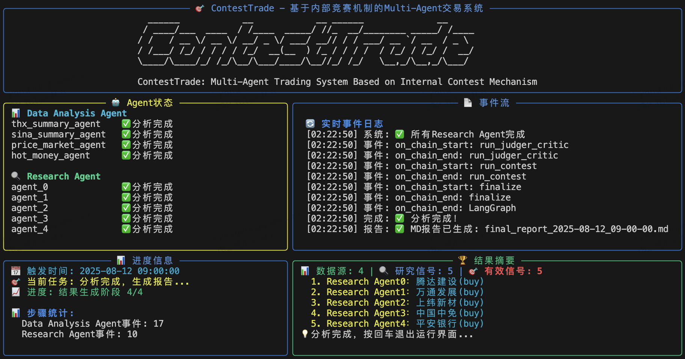
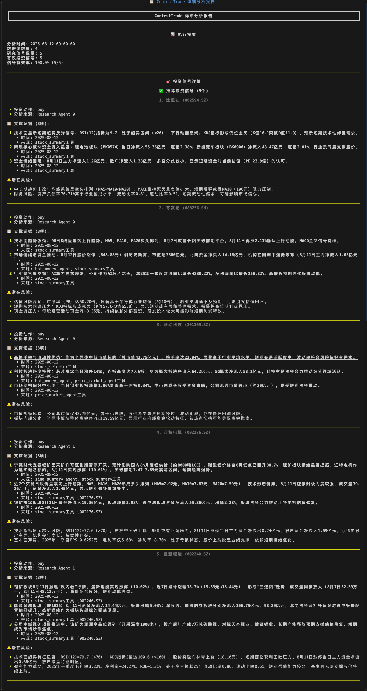

<p align="center">
  
</p>
<div align="center" style="line-height: 1;">
  <a href="https://arxiv.org/abs/2508.00554" target="_blank"></a>
  <a href="https://opensource.org/licenses/Apache-2.0" target="_blank"></a>
  <a href="https://www.python.org/downloads/release/python-3100/" target="_blank"></a>
  <a href="./assets/wechat.png" target="_blank"></a>
</div>
</div>
<div align="center">
  <a href="README.md">中文</a> | <a href="README_en.md">English</a>
</div>

---
# ContestTrade: A Multi-Agent Trading System Based on Internal Contest Mechanism

**ContestTrade** 是一个创新的多智能体（Multi-Agent）交易框架，通过**ContestTrade** 您可以轻松的打造一支专属的AI交易团队。只需设定分析时刻，它能在无人工干预的情况下自主扫描全市场，从海量数据中挖掘潜在事件驱动型的投资机会，并通过内部优选机制，为您构建最值得信赖的投资组合。

## Introduction (项目简介)

ContestTrade 是一个面向事件驱动选股的多智能体交易框架。系统目标是：在没有人工干预的条件下，自动发现、评估并跟踪具有投资价值的事件型机会，最终输出可执行的资产配置建议。

**核心功能**：
- **自动选股**：全市场扫描与信号生成，自动输出可交易的候选股票列表，无需人工逐一筛选。
- **事件驱动**：以新闻、公告、资金流、政策等催化事件为触发，关注具有显著信息冲击的机会。
- **个性化配置**：支持用户自定义智能体的研究偏好和策略，灵活适应不同投资风格。

> 目前框架仅支持 **A股** 市场。

## Framework Overview (框架概览)

<p align="center">
  
</p>

ContestTrade 的工作流程通过一个结构化的双阶段管道来运作，模拟了投资公司的动态决策过程。这个双重竞赛框架确保了最终的决策只被最稳健、最有效的洞察所驱动，从而在复杂的市场中保持了强大的适应性和抗干扰能力。

1.  **数据处理阶段:** 首先，来自多个来源的原始市场数据被输入到**数据团队**。团队中的多个数据分析智能体 (Data Analysis Agents) 并行工作，将这些原始数据提炼成结构化的“文本因子”。在这一阶段，内部竞赛机制会评估每个数据智能体生成的因子的潜在价值，并构建出一个最优的“因子投资组合”。

2.  **研究决策阶段:** 这个最优的因子组合随后被传递给**研究团队**。团队中的多个研究员智能体 (Research Agents) 会基于各自独特的“交易信念” (Trading Beliefs) 和强大的金融工具集，对这些因子进行并行的深度分析，并各自提交交易提案。随后，第二轮内部竞赛会评估这些交易提案，并最终合成一个统一、可靠的资产配置策略作为最终输出。

## Installation (安装)

```bash
# 1. 克隆项目仓库
git clone https://github.com/FinStep-AI/ContestTrade.git
cd ContestTrade

# 2. (推荐) 创建并激活虚拟环境
conda create -n contesttrade python=3.10
conda activate contesttrade

# 3. 安装项目依赖
pip install -r requirements.txt
```

## Configuration (配置)

在运行ContestTrade之前，您需要配置必要的API密钥和LLM参数。

编辑 `config.yaml` 文件，填入您的API密钥。下表列出了所有必需和可选的密钥：

<div align="center">

| 配置项 (Key) | 描述 (Description) | 必需 (Required) |
| :--- | :--- | :---: |
| `TUSHARE_KEY` | Tushare 数据接口密钥 | ✅ |
| `BOCHA_KEY` | Bocha 搜索引擎密钥 | ❌ |
| `SERP_KEY` | SerpAPI 搜索引擎密钥 | ❌ |
| `LLM` | 用于通用任务的LLM API | ✅ |
| `LLM_THINKING` | 用于复杂推理的LLM API | ❌ |
| `VLM` | 用于视觉分析的VLM API | ❌ |

</div>

> 注意：LLM API 和 VLM API 需要您自行申请，具体根据您使用的平台和模型填写URL、API Key以及模型名称。若您没有Tushare的API密钥，目前也支持在`contest_trade/config/config.akshare.yaml`中配置LLM API。

## Preference (选股偏好)

每个 Research Agent 对应一条“交易信念（belief）”，系统会根据这些信念并结合数据与工具生成投资信号（每条信念最多输出5个信号）。配置文件位于 `contest_trade/config/belief_list.json`，其格式为一个 JSON 字符串数组。

示例 1 — 偏好短期事件驱动（更激进）:
```json
[
  "专注于短期事件驱动机会：优先关注公司公告、并购重组、订单暴增、技术突破等催化事件；偏好中小市值、高波动的题材股，适合激进套利策略。"
]
```

示例 2 — 偏好稳健事件（更保守）:
```json
[
  "专注于稳健的确定性事件：关注分红、回购、业绩预告确认、重大合同落地和政策利好等；偏好大盘蓝筹、低波动、确定性高的标的，适合稳健配置。"
]
```

默认配置:
```json
[
  "基于提供的资讯内容综合考虑各公司的业务动态、行业趋势以及潜在的市场影响。为两个群体推荐接下来的交易日具有投资潜力的股票组合:群体1：风险偏好者（偏好波动率大、收益率高，中低市值的股票）;群体2：稳健投资者（偏好低波动率、稳定收益、高市值的股票）。",
  "基于近期突发性事件、政策调整及企业公告等催化剂因素，结合市场情绪传导路径和资金博弈特征。为两类不同风格的投资者筛选事件驱动型机会：群体1：激进套利者（偏好重组预期、订单暴增、技术突破等强题材的小盘股）；群体2：防御套利者（偏好分红上调、大宗回购、特许经营权获取等确定性事件的蓝筹股）。需注意北向资金异动与龙虎榜机构席位动向形成的共振效应。"
]
```

说明（可选）：将您偏好的文本描述逐条加入 `contest_trade/config/belief_list.json` 中，系统会为每条信念分别运行相应的 Research Agent 并输出信号。

## Usage (使用方法)

您可以通过命令行界面（CLI）轻松启动ContestTrade。

```bash
python -m cli.main run
```

程序启动后，您将进入终端交互式界面，可以选择具体分析时间。
<p align="center">
  
</p>

选择时间后，您需要进一步选择所采用的配置文件。
<p align="center">
  
</p>

验证完成后，您将会看到以下显示并进入运行界面。
<p align="center">
  
</p>

所有Agent运行完成后可在结果摘要中查看Agent给出的信号。
<p align="center">
  
</p>

同时可以进一步选择查看详细的报告。
<p align="center">
  
</p>

<p align="center">
  
</p>

## 🌟 我们的愿景与路线图 (Vision & Roadmap)

我们坚信AGI时代即将到来，我们希望能够借助开源社区的力量，探索AGI时代下量化交易的新范式。

该项目致力于研发更完善的基础设施和更丰富的Agent，探索AI在金融交易的能力边界，打造一个稳定、可信、且能规模化扩展的Agent交易框架。

### 项目路线图 (Roadmap)

**V0.1.0 (当前-开发中): 框架稳定性增强 & 核心体验优化**
- [ ] 核心数据源模块解耦，实现多数据源的adaptor (`data-provider` refactor)
- [ ] 优化CLI日志与交互体验

**V0.2.0 (计划中): 市场与功能拓展**
- [ ] 接入 **美股** 市场数据
- [ ] 引入更丰富的因子与信号来源

**未来规划 (Future):**
- [ ] 支持港股及其他市场
- [ ] 可视化回测与分析界面
- [ ] 支持更多Agent的scale up

## Contributing (贡献指南)

ContestTrade 是一个由社区驱动的开源项目，我们欢迎任何形式的贡献！

如果您是开发者，可以参考我们的 **[贡献指南 (CONTRIBUTING.md)](CONTRIBUTING.md)** 成为ContestTrade的贡献者。

我们同样珍视非代码形式的贡献，包括：
* **提出功能建议或反馈Bug:** [前往 Issues 页面](https://github.com/FinStep-AI/ContestTrade/issues)
* **反馈您的测试效果:** 包括测试结果、使用体验等。

## Star History

<div align="center">
  <a href="https://star-history.com/#FinStep-AI/ContestTrade&Date">
    
  </a>
</div>

## 风险声明

**重要声明:** 本项目 `ContestTrade` 是一个开源的量化交易Agent框架研究项目，仅供学术研究和教育目的使用。项目中包含的示例、数据和分析结果不构成任何形式的投资建议。

**风险提示:**
*   **市场风险:** 本项目不构成任何形式的投资、财务、法律或税务建议。所有输出，包括交易信号和分析，均为基于历史数据的AI模型推演结果，不应被视为任何买卖操作的依据。
*   **数据准确性:** 框架使用的数据源可能存在延迟、不准确或不完整的情况。我们不对数据的可靠性做任何保证。
*   **模型幻觉:** AI模型（包括大型语言模型）存在固有的局限性和“幻觉”风险。我们不保证框架生成信息的准确性、完整性或及时性。
*   **责任自负:**  开发者不对任何因使用或无法使用本框架而导致的直接或间接损失承担任何责任。投资有风险，入市需谨慎。

**在将本框架用于任何实际交易决策之前，请务必充分了解相关风险。**

## Citation (引用)

如果您在您的研究中使用了ContestTrade，请引用我们的论文：

```bibtex
@misc{zhao2025contesttrade,
      title={ContestTrade: A Multi-Agent Trading System Based on Internal Contest Mechanism}, 
      author={Li Zhao and Rui Sun and Zuoyou Jiang and Bo Yang and Yuxiao Bai and Mengting Chen and Xinyang Wang and Jing Li and Zuo Bai},
      year={2025},
      eprint={2508.00554},
      archivePrefix={arXiv},
      primaryClass={q-fin.TR}
}
```

## License (许可证)

本项目采用 [Apache 2.0 License](LICENSE) 许可证。
